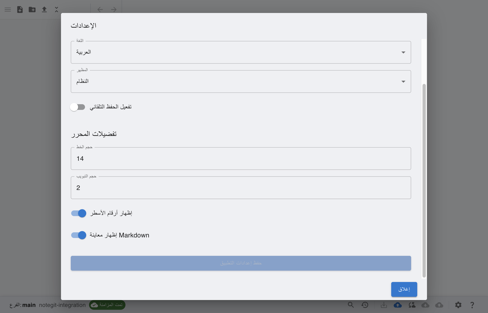

# notegit

Your Markdown workspace for real projects, docs, and personal knowledge bases, backed by Git, AWS S3, or Local storage.

**Version**: 2.8.2  
**License**: MIT

## Built for daily note workflows

notegit keeps your notes where your work already lives. Write in Markdown, connect to your repository type of choice, and keep everything organized and versioned in one desktop app.

## See it in action

### Write and preview side by side

### Organize notes quickly

### Work in your language

Supported languages:

- English
- Chinese (中文)
- Hindi (हिन्दी)
- Spanish (Español)
- German (Deutsch)
- Arabic (العربية)
- French (Français)
- Russian (Русский)
- Portuguese (Português)
- Japanese (日本語)
- Turkish (Türkçe)
- Italian (Italiano)
- Polish (Polski)
- Ukrainian (Українська)
- Kurdish (Kurdî)
- Swedish (Svenska)
- Greek (Ελληνικά)

### Use notegit in dark mode

## What you can do

- Connect Git, AWS S3, or Local repositories
- Create Markdown notes with editor, preview, and split view
- Organize files and folders with rename, move, duplicate, and favorites
- Search and replace in current file and across the repository
- Review file history and versions
- Export the current note or the full repository as ZIP

## Installation

All releases: [github.com/scabir/notegit/releases](https://github.com/scabir/notegit/releases)

## User Guide

New to notegit? Start here with a complete walkthrough:
[Read the User Guide with setup steps, daily workflows, and troubleshooting](docs/USER_GUIDE.md)

## Tutorials

- [Connect Git Repository](tutorials/scenarios/connect-git-repository/README.md)
- [Create and Edit Markdown (Preview + Split)](tutorials/scenarios/create-and-edit-markdown-preview-split/README.md)
- [Organize Files: Rename, Move, Duplicate, Favorite](tutorials/scenarios/organize-files-rename-move-duplicate-favorite/README.md)
- [Search and Replace (File + Repository)](tutorials/scenarios/search-and-replace-file-and-repo/README.md)
- [Commit, Pull, Push from Status Bar](tutorials/scenarios/commit-pull-push-from-status-bar/README.md)
- [View History and Restore Reference](tutorials/scenarios/view-history-and-restore-reference/README.md)
- [Export Note and Repository ZIP](tutorials/scenarios/export-note-and-export-repository-zip/README.md)
- [Connect AWS S3 Bucket with Prefix](tutorials/scenarios/connect-s3-bucket-with-prefix/README.md)
- [Edit and Auto-Sync Pending Changes](tutorials/scenarios/edit-and-auto-sync-pending-to-synced/README.md)
- [AWS S3 History with Versioned Objects](tutorials/scenarios/s3-history-with-versioned-objects/README.md)
- [Create Local Repository and Work Offline](tutorials/scenarios/create-local-repository-and-work-offline/README.md)
- [Local Save and Reopen Persistence Check](tutorials/scenarios/local-save-and-reopen-persistence-check/README.md)
- [Switch Language and Verify Persistence](tutorials/scenarios/switch-language-and-verify-persistence/README.md)

Tutorial hub: [tutorials/README.md](tutorials/README.md)

## Technical Documentation

- [Technical Documentation](docs/tech/README.md)

## Support

Open an issue: https://github.com/scabir/notegit/issues

## Outro

Thanks for using notegit.

Built and maintained by **Suleyman Cabir Ataman**.
