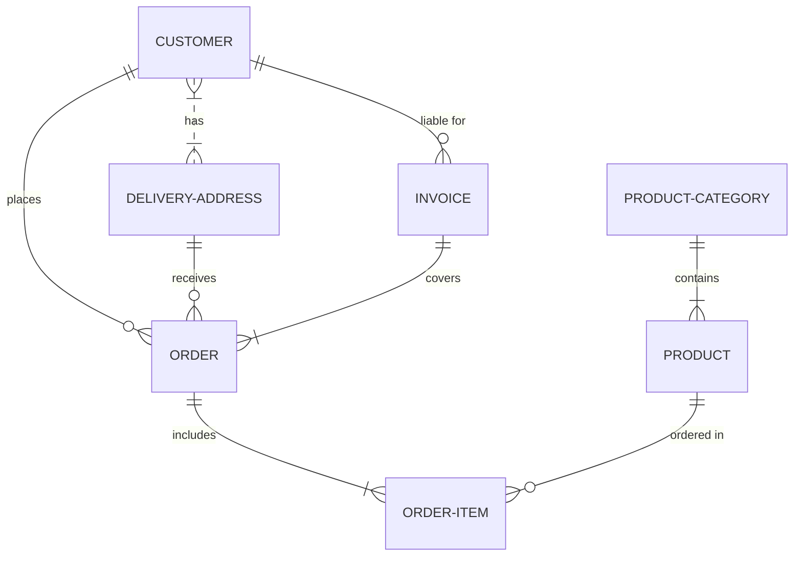

# notegit User Guide

Complete guide to using notegit - your Git-, S3-, or local-backed markdown note-taking application.

**Version**: 2.3.0  
**Last Updated**: February 5, 2026

---

## Table of Contents

1. [Quick Start](#quick-start)
2. [First-Time Setup](#first-time-setup)
3. [Connecting to a Repository](#connecting-to-a-repository)
4. [Creating and Editing Notes](#creating-and-editing-notes)
5. [File and Folder Management](#file-and-folder-management)
6. [Search and Find & Replace](#search-and-find--replace)
7. [Git Operations](#git-operations)
8. [History and Versions](#history-and-versions)
9. [Import and Export](#import-and-export)
10. [Settings and Customization](#settings-and-customization)
11. [Keyboard Shortcuts](#keyboard-shortcuts)
12. [Troubleshooting](#troubleshooting)

---

## First-Time Setup

### System Requirements

- **Operating System**: macOS 10.13+, Windows 10+, or Linux (Ubuntu 18.04+)
- **Git**: Required for Git repositories (not needed for S3 or Local workflows)
- **AWS S3**: Optional for S3 repositories (bucket with versioning enabled + credentials)
- **Internet Connection**: Required for Git/S3 setup and syncing (not required for Local)

### First Launch

1. Open notegit
2. Click **Connect to Repository** and follow the prompts

---

## Connecting to a Repository

### Prerequisites (Git)

- Repository URL (HTTPS or SSH)
- Authentication (PAT or SSH key)
- Branch name (default: `main`)

For S3 repositories, see **Connecting to an S3 Bucket** below. For Local repositories, see **Connecting to a Local Repository**. For PAT/SSH setup, use your Git provider docs.

### Connecting in notegit

#### Git

1. Click **Connect to Repository**
2. **Repository type**: Git
3. Fill **Remote URL**, **Branch**, **Auth Method**, and **PAT** (if HTTPS)
4. Click **Connect**

#### Switching Repositories

- **Settings** → **Repository** → **Disconnect** → **Connect**

---

### Connecting to an S3 Bucket

- **Bucket** and **Region**
- **Access Key ID** + **Secret Access Key** (session token optional)
- **Bucket versioning** enabled (required for history)

Steps:
1. Click **Connect to Repository**
2. **Repository type**: S3
3. Enter **Bucket**, **Region**, optional **Prefix**
4. Enter credentials and click **Connect**

Notes: **Prefix** scopes notes to a folder (e.g., `notes/`). Credentials are stored encrypted locally.

---

### Connecting to a Local Repository

Local repositories are stored on your device only and do not sync.

Steps:
1. Click **Connect to Repository**
2. **Repository type**: Local
3. Enter a **Local Repository Name**
4. Click **Connect**

Notes: notegit creates a folder in its app data directory for the local repository.

---

## Creating and Editing Notes

### Creating Notes

- **New File** icon to create a note (adds `.md` if missing)
- **New Folder** icon to create folders
- Create items inside the selected folder to place them there

### S3 Naming Rules

For S3 repositories, spaces in file or folder names are replaced with `-`.

### Editors

- **Markdown**: split editor + preview, formatting toolbar, save with `Ctrl/Cmd+S`
- **Text**: single-pane editor

### Saving

- Manual: `Ctrl/Cmd+S`
- Auto-save: every 5 minutes by default (configurable)
- Git: save → commit → pull → push
- S3: save locally and upload immediately; background sync continues
- Local: save to disk only (no sync)

### Images

Import images and reference them in markdown: ``

### Mermaid Diagrams

- Mermaid diagrams render in **Split View** or **Preview Only** for `.md` files
- Use fenced code blocks with the `mermaid` language tag
- Other file types show the code block as plain text

Example:

````markdown

````

---

## File and Folder Management

- Select files in the tree to open them
- Rename, move, and delete using the toolbar actions
- Moves validate conflicts and prevent moving into itself
- Deleting a folder removes its contents
- Import adds any file type into the repo

---

## Search and Find & Replace

- **Quick file search**: `Ctrl/Cmd+P` or `Ctrl/Cmd+K`
- **Find in file**: `Ctrl/Cmd+F` (with replace)
- **Find in repo**: `Ctrl/Cmd+Shift+F` (with replace)
- Options: case-sensitive and regex

---

## Git Operations

Git operations apply to Git repositories only.

- Workflow: save → commit → pull → push (automatic)
- Manual controls: fetch, pull, push from the status bar
- Auto-push retries when offline
- Conflicts require an external Git client to resolve

### Local Repositories

- Local repositories do not sync and do not show fetch/pull/push controls
- Saving writes directly to disk

### S3 Sync Behavior

- S3 repositories do not use commits or pull/push buttons
- Sync runs automatically on the **S3 Auto Sync** interval
- Deletes and moves are applied to S3 immediately; if offline, they are queued and retried
- The status bar shows "changes waiting" until the next sync completes

---

## History and Versions

- Open a file to see its history panel
- Click an entry to view a read-only version
- S3 history requires bucket versioning and uses object versions
- Diff view is not available for S3 history
- Local repositories do not provide history

---

## Import and Export

- **Import**: toolbar → choose file and destination (any file type)
- **Export current note**: Settings → Export → choose format and location
- **Export repository**: Settings → Export → ZIP of the repo

---

## Settings and Customization

- **Open Settings**: gear icon or `Ctrl/Cmd+,`
- **App settings**: theme, auto-save, S3 auto sync (S3 profiles)
- **Repository settings**: Git URL/branch, S3 bucket/region/prefix + credentials, or Local info
- **Export**: current note or repository ZIP

### Data Location

Your data is stored in:
- **macOS**: `~/Library/Application Support/notegit/`
- **Windows**: `%APPDATA%/notegit/`
- **Linux**: `~/.config/notegit/`

**Contains**:
- `config/`: Settings files
- `repos/`: Local repository clones
- `logs/`: Application logs

---

## Keyboard Shortcuts

### Shortcut helper

Click the question mark icon to the right of the **Settings** button in the top toolbar (or press `F1`) to open the shortcuts helper. It lists every tree, editor, and global shortcut and stays open until you close it, so you can review the combinations before committing to a change.

### File tree shortcuts

| Shortcut | Action |
|----------|--------|
| `Ctrl/Cmd + A` | Add a new file (placed in the current folder or root) |
| `Ctrl/Cmd + D` | Create a new folder inside the selected directory |
| `Delete` / `Cmd + Delete` (mac) | Remove the selected file or folder |
| `Ctrl/Cmd + I` | Import a file into the selected folder |
| `Ctrl/Cmd + R` / `F2` | Rename the selected file or folder |
| `Ctrl/Cmd + M` | Move the selected item to another folder via the picker |
| `Ctrl/Cmd + Shift + U` | Duplicate the selected file in place |
| `Ctrl/Cmd + Shift + S` | Toggle favorite on the selected item and surface it in the favorites bar |

Right-click any file or folder in the tree to open a context menu that mirrors the toolbar actions (rename, move, favorite/unfavorite, delete) along with their icons; if nothing is selected, right-clicking the empty tree background still shows New File, New Folder, and Import options (also with icons).

Clicking empty space in the tree clears the selection so you can start a new action from the root; the toolbar no longer has a dedicated clear-selection button, but the same behavior is provided by this click target.

### Markdown editor shortcuts

| Shortcut | Action |
|----------|--------|
| `Ctrl/Cmd + B` | Bold |
| `Ctrl/Cmd + T` | Italic |
| `Ctrl/Cmd + H` | Heading (`## `) |
| ``Ctrl/Cmd + ` `` | Wrap the selection in inline code |
| `Ctrl/Cmd + Shift + {` / `}` | Surround text with triple backticks for code blocks |
| `Ctrl/Cmd + L` | Insert a link template |
| `Ctrl/Cmd + Shift + T` | Insert a markdown table skeleton |
| `Ctrl/Cmd + Shift + F` | Insert a numbered footnote marker plus definition |
| `Ctrl/Cmd + Shift + L` | Toggle a task list for the selection |
| `Ctrl/Cmd + Shift + H` | Highlight text with `==` markers |
| `Ctrl/Cmd + Shift + D` | Insert a definition list pair |
| `Ctrl/Cmd + Shift + M` | Insert a Mermaid diagram block |

### Global shortcuts

| Shortcut | Action |
|----------|--------|
| `Ctrl/Cmd + S` | Save the current note |
| `Ctrl/Cmd + P` | Open quick file search |
| `Ctrl/Cmd + K` | Alternate quick search key |
| `Ctrl/Cmd + F` | Find inside the current file |
| `Ctrl/Cmd + Shift + F` | Search across the repository |
| `Ctrl/Cmd + ,` | Open settings |
| `Ctrl/Cmd + Q` | Quit the application |
| `F1` | Show or hide the shortcut helper |

### Favorites bar

- A favorites strip sits immediately above the tree view, listing starred files and folders by name only (hover any entry to reveal the full path).
- Toggle the bracketed star icon in the tree toolbar or press `Ctrl/Cmd + Shift + S` when a node is selected to add or remove it from the strip.
- Right-click a favorite, choose “Remove from favorites,” and it will disappear without needing to select a new node.

### Find & replace shortcuts

| Shortcut | Action |
|----------|--------|
| `Enter` | Highlight the next match |
| `Shift+Enter` | Highlight the previous match |
| `Esc` | Close the find bar |

### Tree navigation

| Shortcut | Action |
|----------|--------|
| `↑` / `↓` | Move through the tree view |
| `Enter` | Open the selected file |
| `Delete` | Prompt to delete the selected item |

---


## Troubleshooting

- Authentication failed: verify URL/branch/credentials and repo access
- S3 versioning required: enable bucket versioning in AWS
- S3 changes not syncing: check S3 Auto Sync toggle/interval and credentials
- Local repo not syncing: expected behavior (local-only mode)
- Push fails or conflicts (Git): resolve in a Git client, then pull again
- Mermaid not rendering: ensure `.md` file, a fenced code block with `mermaid`, and Preview/Split View
- Slow performance: large repos or many files
- White screen: restart, check logs, reinstall if needed
- Lost changes: check file history or your Git client

### Logs

Logs are in: `~/Library/Application Support/notegit/logs/`

- `main.log`: General application logs
- `error.log`: Error messages

### Report Issues

Open an issue at [GitHub Issues](https://github.com/scabir/notegit/issues) with steps, OS/version, and relevant logs.

---

## Best Practices

- Keep folders shallow and names clear (use hyphens, add dates when useful)
- Export backups periodically
- For S3, avoid spaces (auto-converted to `-`)
- Use basic Markdown: headings, lists, links, code blocks
- Use Mermaid code blocks for diagrams in `.md` files

---

## About notegit

**Version**: 2.2.4  
**Author**: Suleyman Cabir Ataman, PhD  
**GitHub**: [github.com/scabir/notegit](https://github.com/scabir/notegit)  
**License**: MIT

### Credits

Built with:
- Electron - Desktop framework
- React - UI library
- TypeScript - Type safety
- Material-UI - Component library
- CodeMirror - Editor
- simple-git - Git operations

---

**Need more help?** Check the [main README](./README.md) for technical details or open an issue on [GitHub](https://github.com/scabir/notegit/issues).

Happy note-taking! 📝
