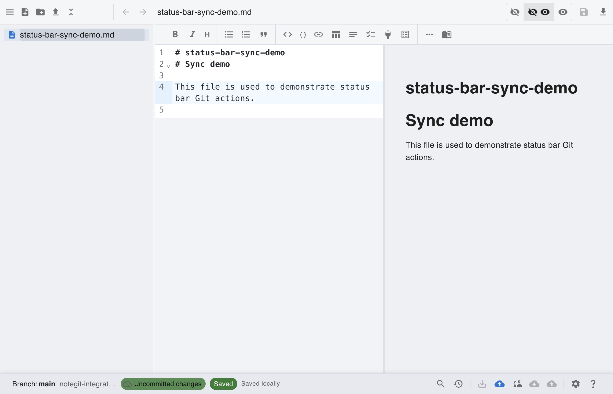
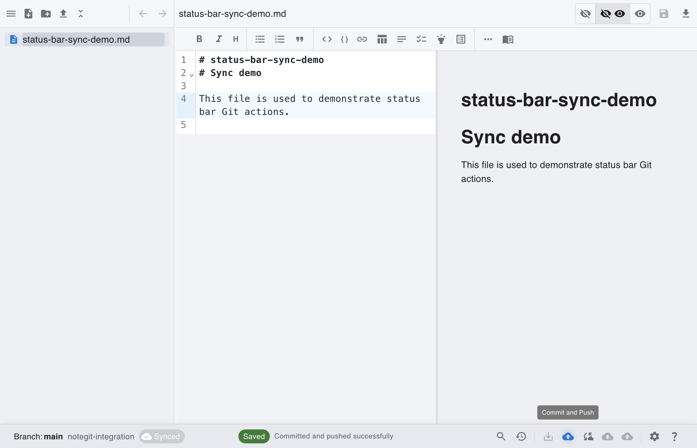
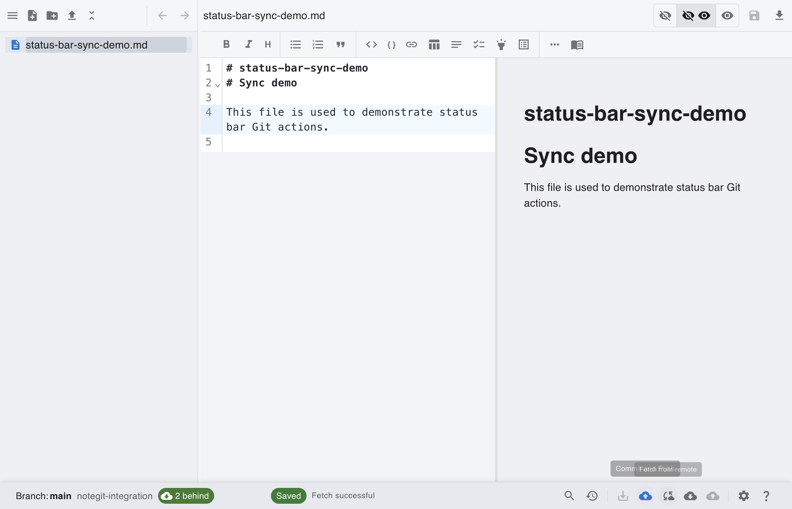
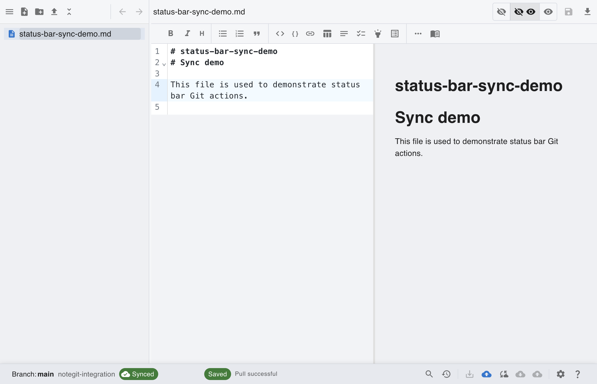

# [Git] Commit, Pull, Push from Status Bar

This scenario shows a practical status bar workflow: save changes, commit+push, fetch remote updates, then pull.

## Step 1: Start from connected Git workspace

Connect to your repository first, then use status bar actions for sync operations.

## Step 2: Create and save a local change

Create a note and save it so the status bar shows changes ready to commit.

## Step 3: Commit and push from status bar

Use **Commit + Push** to publish your local changes to the remote branch.

## Step 4: Fetch remote updates

Use **Fetch** to refresh remote state and detect incoming commits before pulling.

## Step 5: Pull to sync local branch

Use **Pull** when behind to bring local branch up to date with remote commits.

