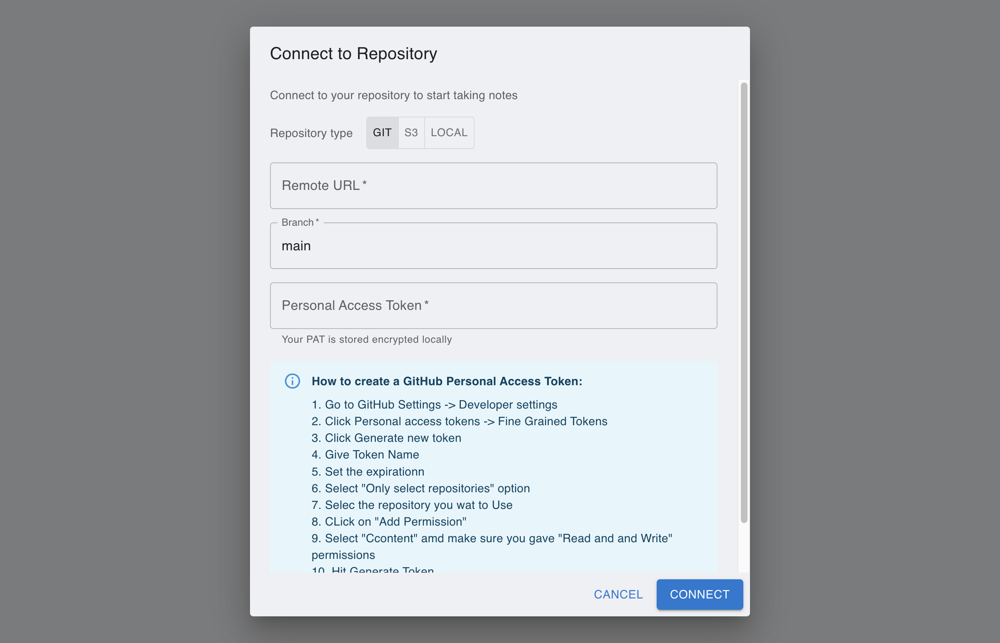
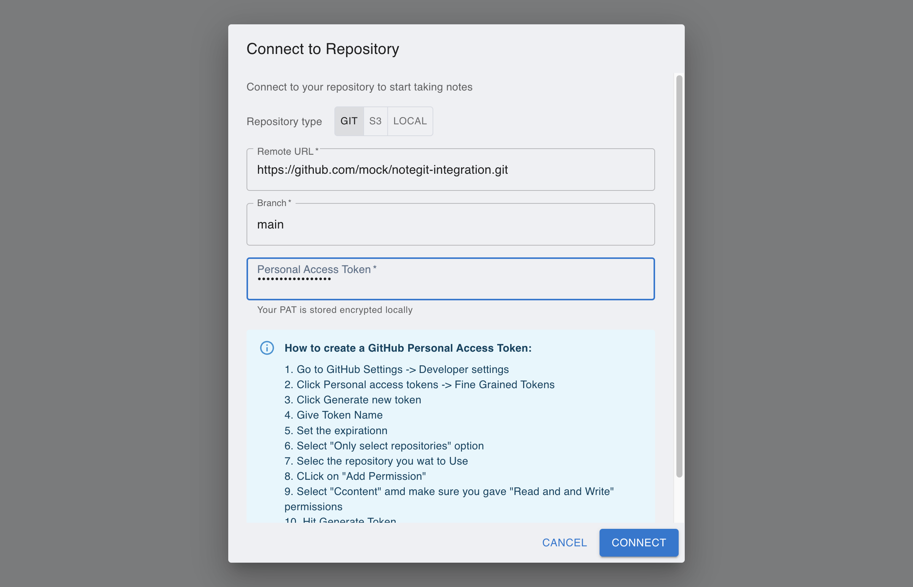

# [Git] Connect Git Repository

This tutorial is generated with Playwright against the local NoteBranch app in mock Git mode.

## Step 1: Open NoteBranch and start repository setup

From the first launch screen, click **Connect to Repository** to start linking your Git remote.

## Step 2: Open the Git connection dialog

Keep **Repository Type** on Git, then prepare remote URL, branch, and credentials.

## Step 3: Enter remote URL, branch, and token

Fill the Git details and review them before you click **Connect**.

## Step 4: Verify repository connected successfully

After connecting, the workspace loads with the file tree and branch status visible.

## Manual Steps Not Captured in Screenshots

### Git authentication checklist

1. Create a Personal Access Token (PAT) in your Git provider account.
2. Grant repository read/write scope required by your remote.
3. Copy token securely and paste it in the **Personal Access Token** field.
4. If your organization enforces SSO, authorize the token before connecting.

### AWS S3 checklist (for AWS S3 connection scenarios)

1. Enable bucket versioning in AWS S3.
2. Prepare Access Key ID and Secret Access Key with AWS S3 read/write permissions.
3. Enter bucket, region, optional prefix, and credentials in NoteBranch.
