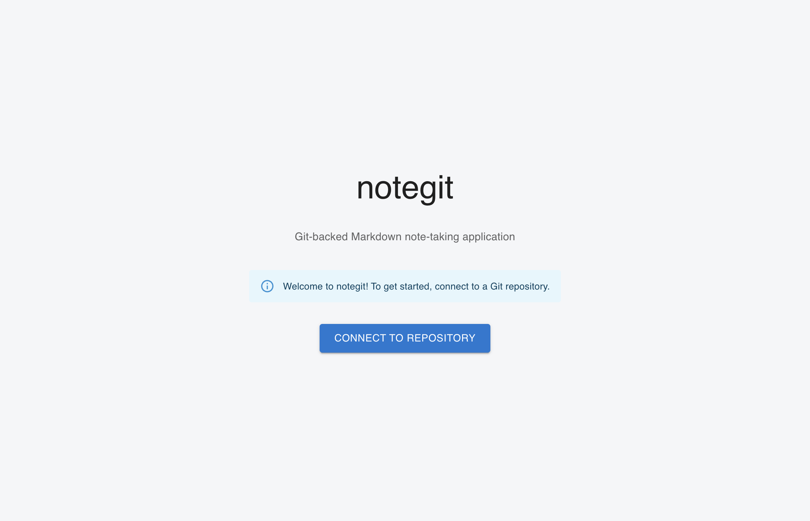
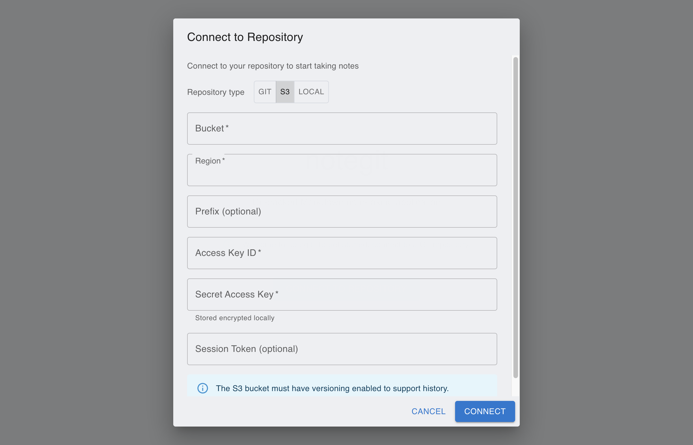
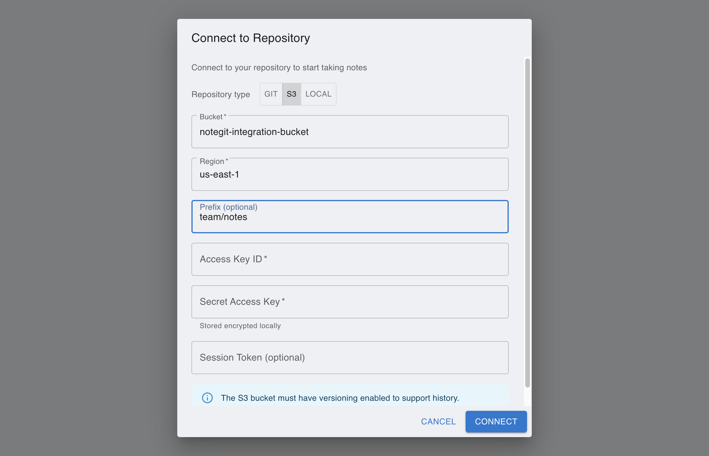
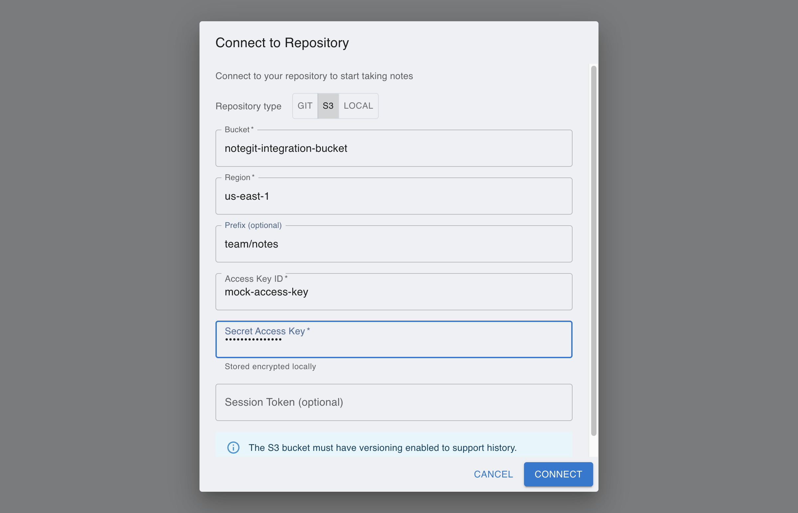
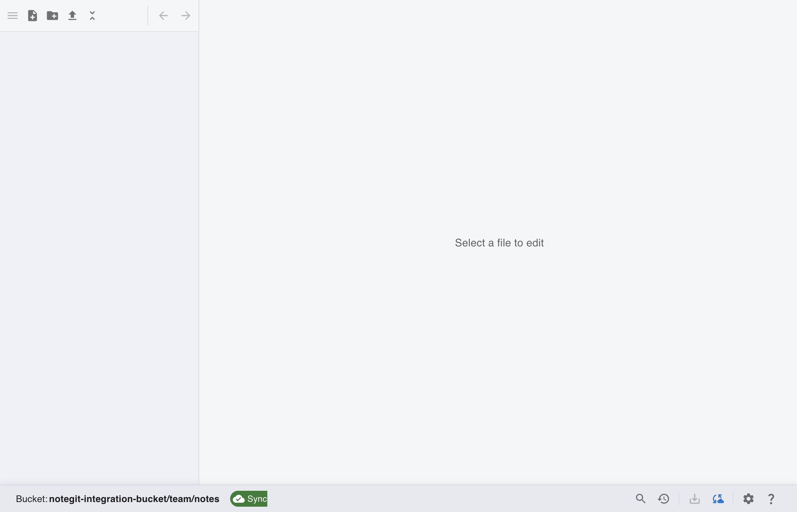

# [AWS S3] Connect AWS S3 Bucket with Prefix

This tutorial is generated with Playwright against the local NoteBranch app in mock AWS S3 mode.

## Step 1: Open NoteBranch and start repository setup

From the first launch screen, click **Connect to Repository** to configure AWS S3 access.

## Step 2: Switch repository type to AWS S3

In the connect dialog, choose **AWS S3** so bucket and credential fields are shown.

## Step 3: Fill bucket, region, and prefix

Set a prefix to scope notes to a folder-like path inside the bucket.

## Step 4: Enter AWS credentials

Add Access Key ID and Secret Access Key, then verify all fields before connecting.

## Step 5: Verify AWS S3 repository connected

After connect, workspace loads and repository status confirms AWS S3 connection with prefix scope.

## Manual Steps Not Captured in Screenshots

### AWS S3 setup checklist

1. Open AWS S3 and verify bucket versioning is enabled.
2. Create or use IAM credentials with AWS S3 read/write permissions for the target bucket.
3. Copy Access Key ID and Secret Access Key.
4. In NoteBranch, enter bucket, region, optional prefix, and credentials.
5. If your organization rotates credentials, update them in Settings when sync fails.
