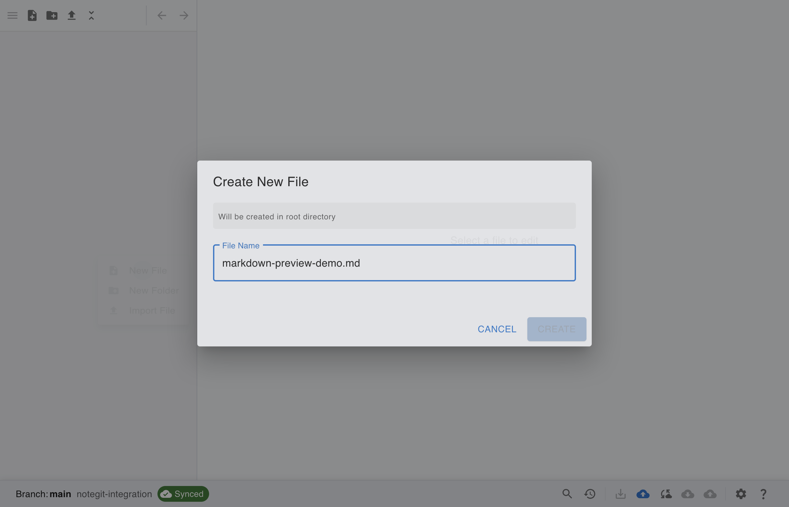
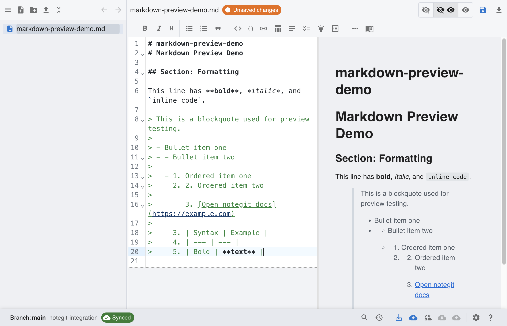
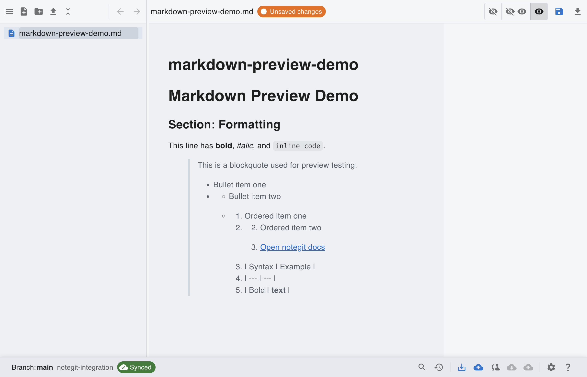
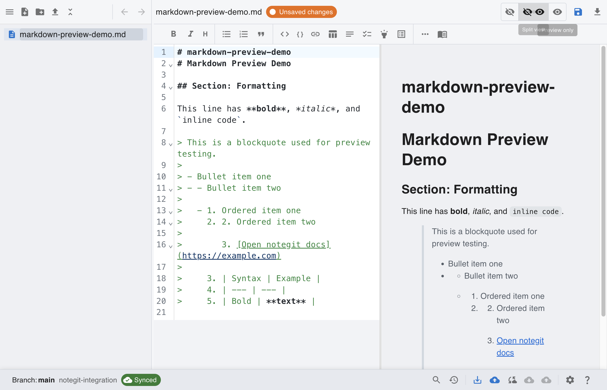

# [Git] Create and Edit Markdown in Preview + Split

This scenario starts from a connected Git workspace and focuses on markdown creation, editing, and preview modes.

## Step 1: Start from connected Git workspace

Repository setup is complete. Begin from a connected workspace before creating your markdown note.

## Step 2: Create a new markdown file

Open the file tree context menu, choose **New File**, and enter a markdown filename.

## Step 3: Edit markdown content

Add headings, emphasis, inline code, quote, lists, link, and table content in the editor.

## Step 4: Review in preview-only mode

Switch to **Preview Only** to validate rendered markdown output without editor pane.

## Step 5: Compare source and render in split view

Switch to **Split View** to see raw markdown and rendered output side by side.

