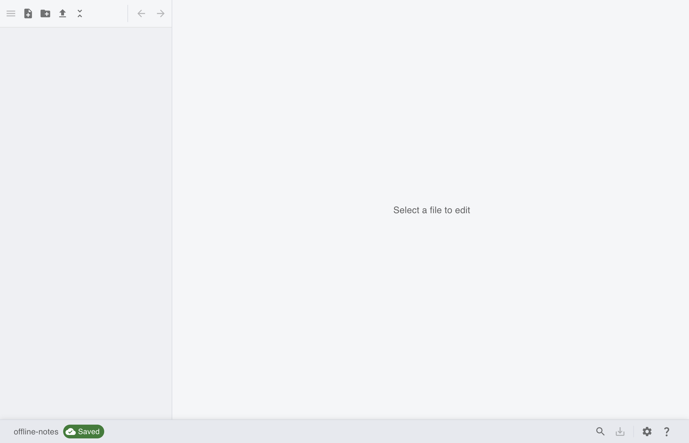
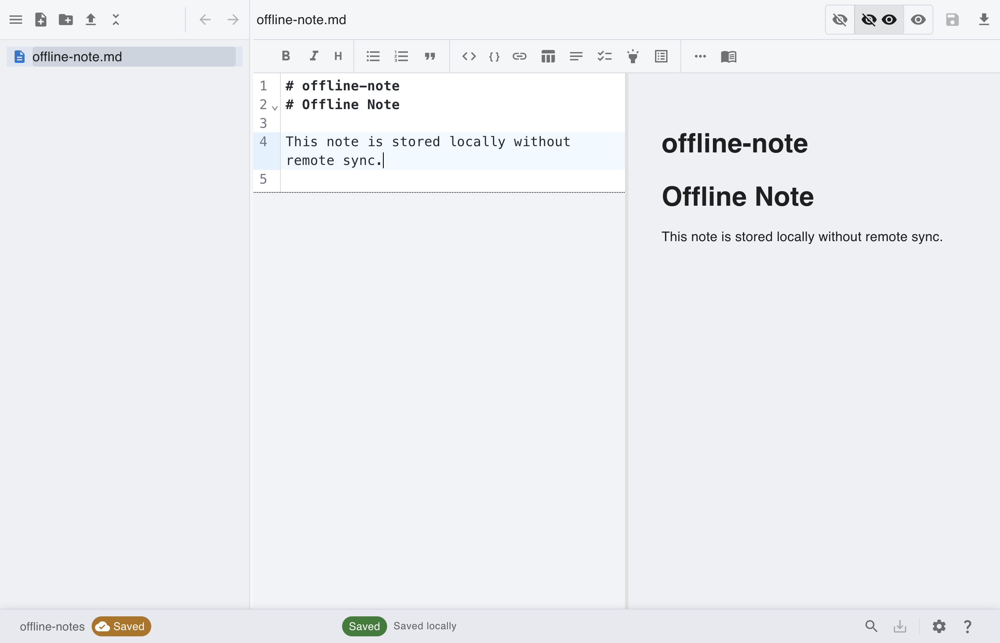
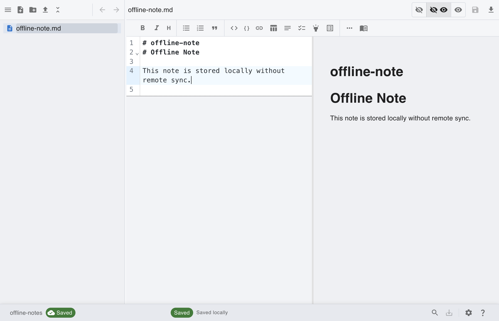

# [Local] Create Local Repository and Work Offline

This scenario demonstrates local-only workflow with no remote network sync operations.

## Step 1: Open notegit and start repository setup

From first launch, click **Connect to Repository** to choose local provider.

## Step 2: Connect a local repository

Select **Local**, enter a repository name, and connect. Remote sync actions are hidden in local mode.

## Step 3: Create and edit note offline

Create a markdown note and save it locally without any remote Git or S3 synchronization.

## Step 4: Continue working offline

You can keep organizing and editing notes locally while disconnected from the network.

## Offline Notes

- Local repositories keep files on your device only.
- Fetch/Pull/Push actions are not shown for local provider.
