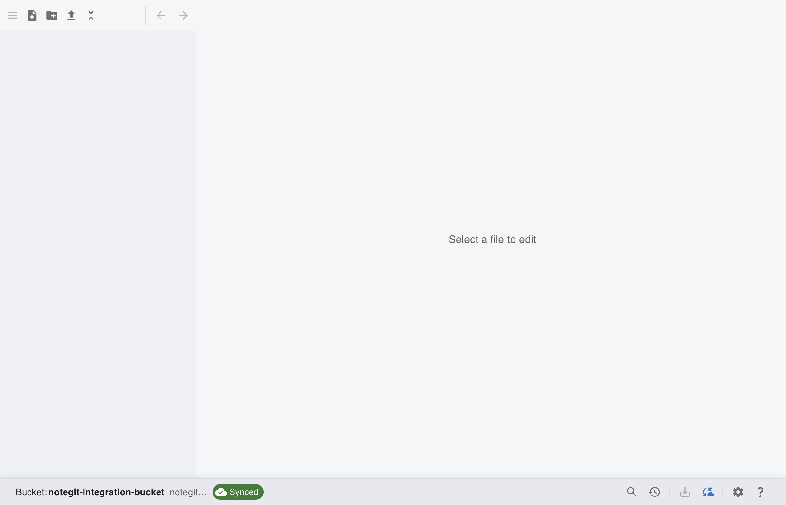
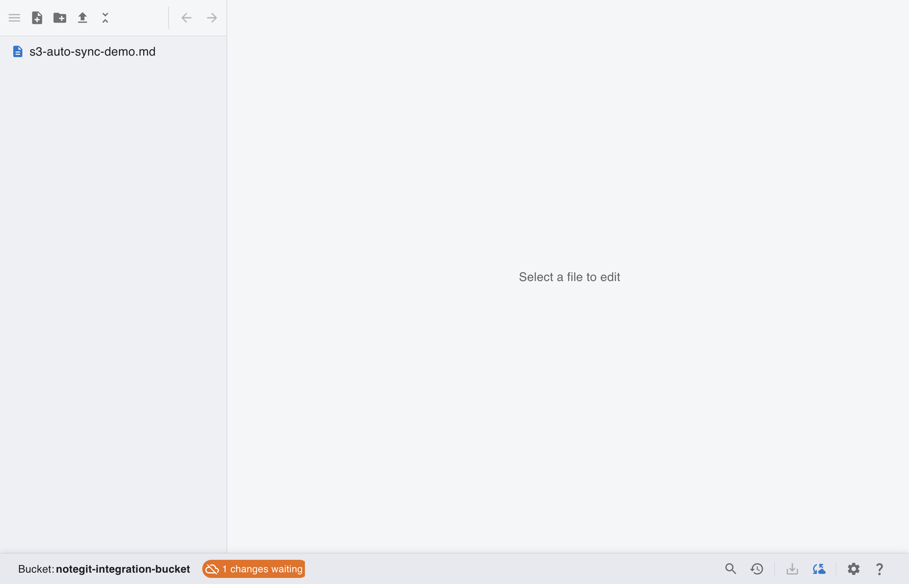
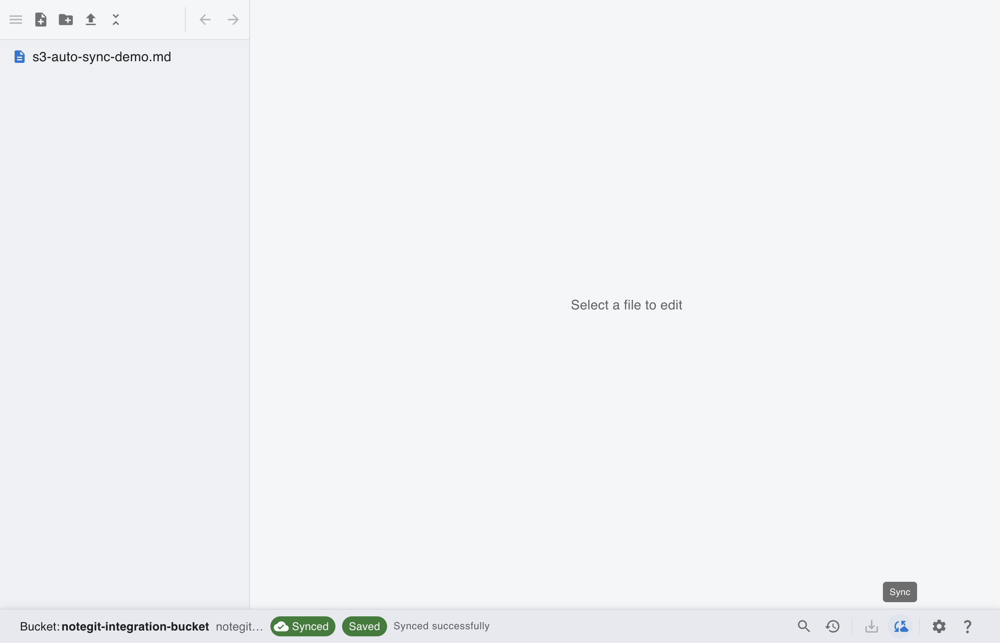

# [S3] Edit and Auto Sync (Pending to Synced)

This scenario shows the S3 sync status transition from pending local changes to synced state.

## Step 1: Start from connected S3 workspace

Connect to S3 first so status bar sync actions and pending counters become available.

## Step 2: Create local S3 changes

Create local note changes first so S3 sync chip can transition from pending to synced.

## Step 3: Observe pending sync state

Before upload completes, sync chip shows pending local changes waiting to be synced.

## Step 4: Trigger immediate sync from status bar

Use the status bar sync action to upload pending changes immediately.

## Step 5: Confirm synced state

After upload finishes, the sync chip returns to **Synced**.

## Manual Notes

- S3 auto sync also runs on interval from App Settings.
- Use the status bar sync action when you need immediate upload.
