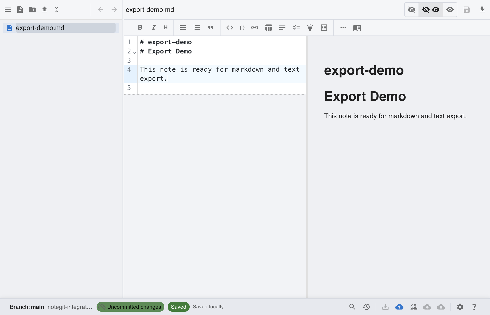
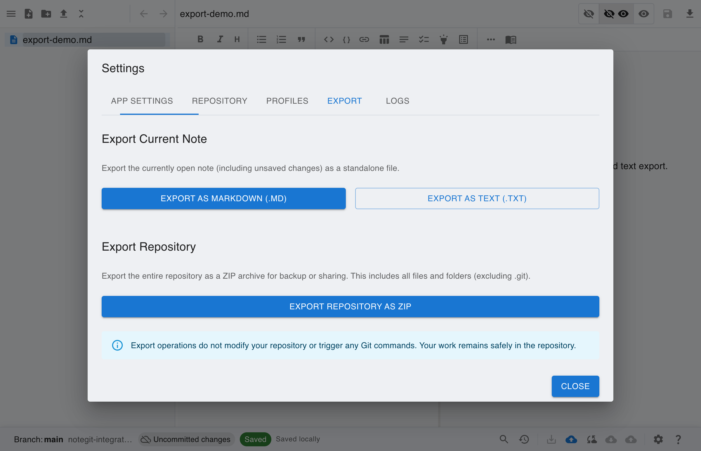

# [Git] Export Note and Export Repository ZIP

This scenario walks through exporting a single note and exporting the full repository ZIP from Settings.

## Step 1: Start from connected Git workspace

Connect to your repository and open the workspace before exporting notes or repository backups.

## Step 2: Create and open the note to export

Open a note in the editor first, because note export requires current note content.

## Step 3: Open Settings export tab

Open Settings from the status bar and switch to the **Export** tab.

## Step 4: Choose note export format

Use markdown or text export buttons to save the current note in your preferred format.

## Step 5: Export full repository as ZIP

Use **Export Repository as ZIP** to create a backup/archive of all repository files.

## Manual Steps Not Captured in Screenshots

### Save dialog flow

1. Click **Export as Markdown (.md)** or **Export as Text (.txt)**.
2. In the system Save dialog, choose destination and file name, then confirm.
3. Click **Export Repository as ZIP** and confirm destination in the Save dialog.
4. Wait for completion message in Settings.
