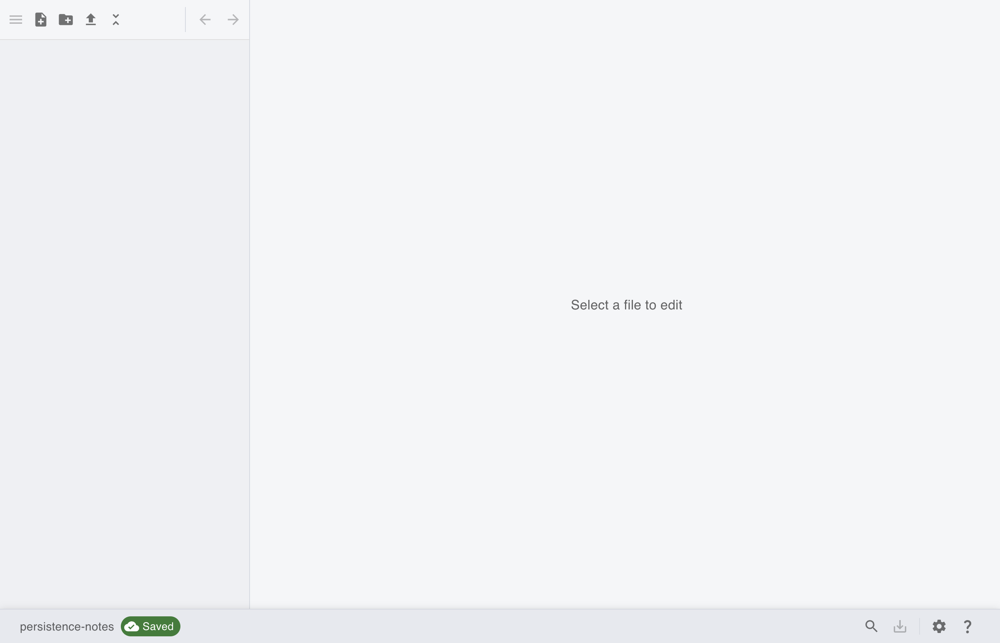
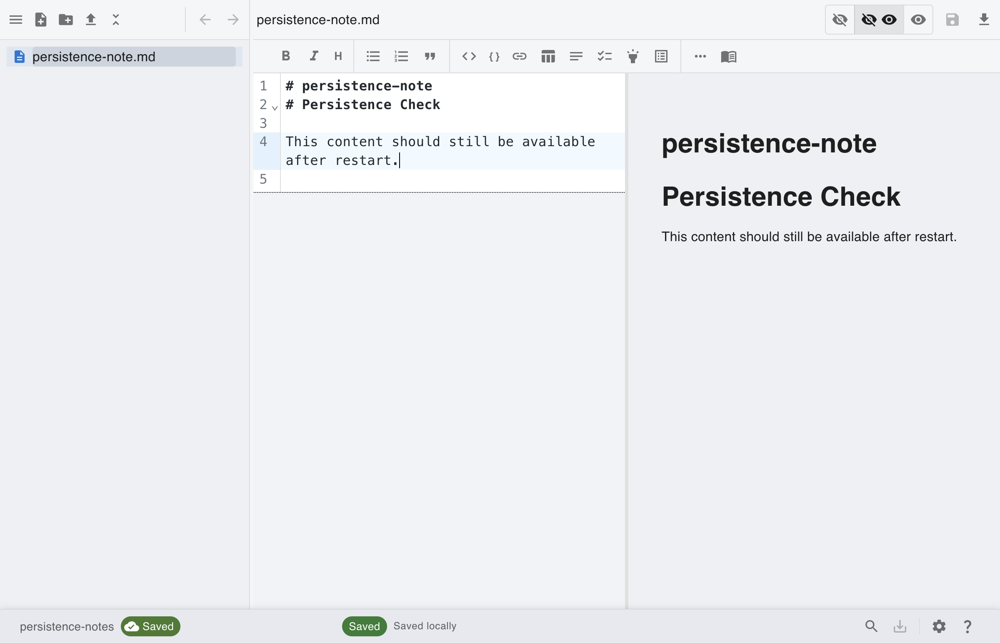
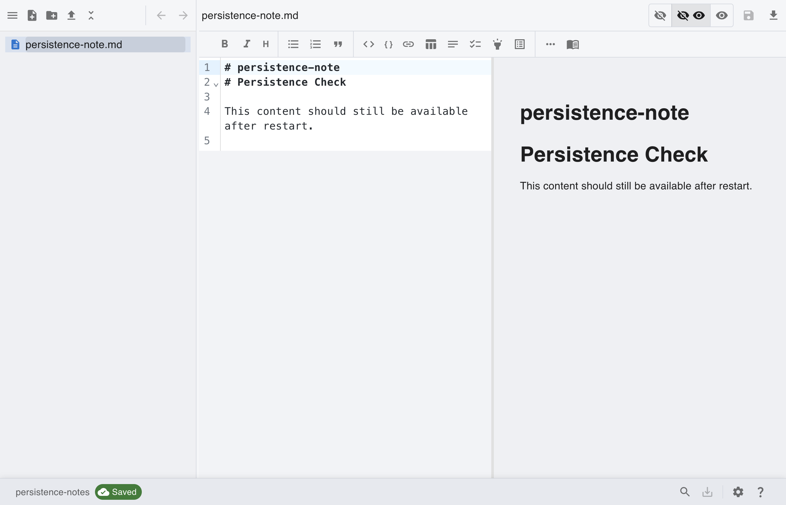

# [Local] Save and Reopen Persistence Check

This scenario verifies local notes are persisted and restored after closing and reopening notegit.

## Step 1: Connect local repository

Connect using Local provider so data is stored on this device for persistence checks.

## Step 2: Save local note

Create and save local note content before closing the app.

## Step 3: Reopen app and verify file exists

After restart, local repository opens directly and previously saved files remain in the tree.

## Step 4: Confirm content persistence

Open the note after restart and confirm saved content is still available.

