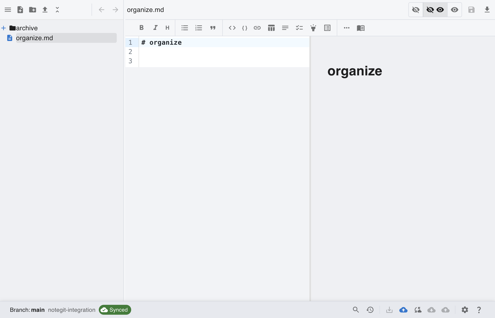
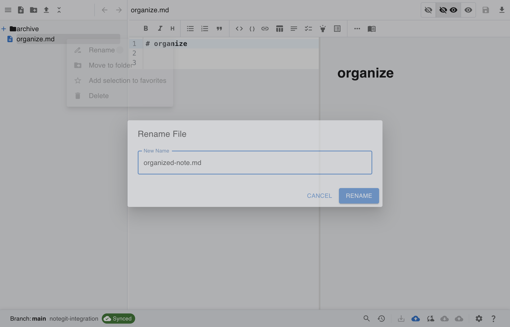
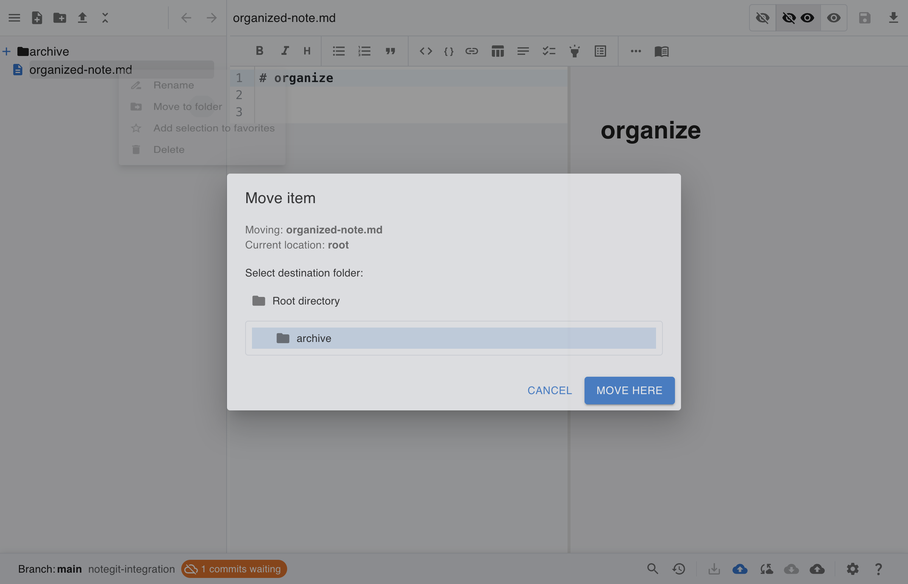
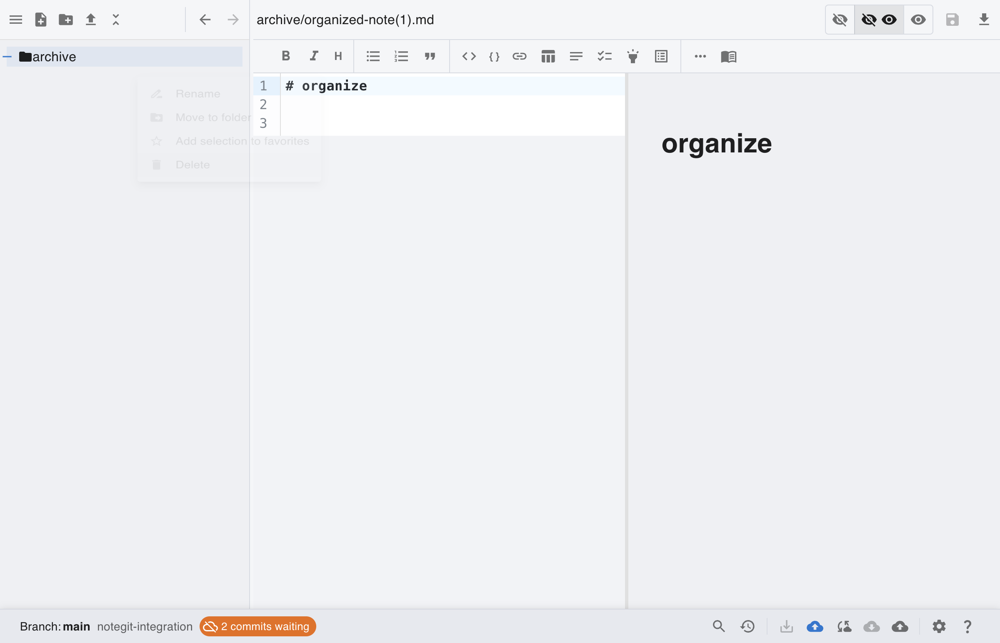
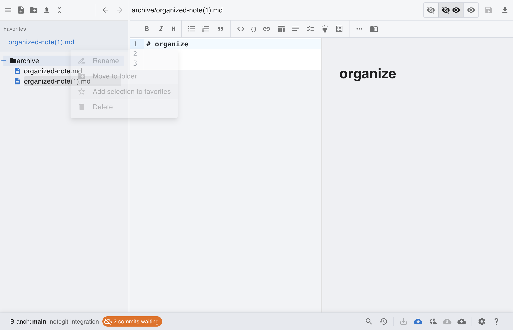

# [Git] Organize Files: Rename, Move, Duplicate, Favorite

This scenario starts from a connected Git workspace and shows common file organization actions in the tree.

## Step 1: Start from connected Git workspace

Repository setup is complete. Begin from a connected workspace before organizing files.

## Step 2: Create initial file and destination folder

Create one file and one folder first so you can apply rename and move actions.

## Step 3: Rename file

Use **Rename** from the file context menu and enter the new file name.

## Step 4: Move file into folder

Open **Move** from context menu, pick target folder, then confirm with **Move Here**.

## Step 5: Duplicate file

Use **Duplicate** from file context menu to create a numbered copy in the same folder.

## Step 6: Add file to favorites

Use **Add to favorites** from context menu to pin frequently used notes.

