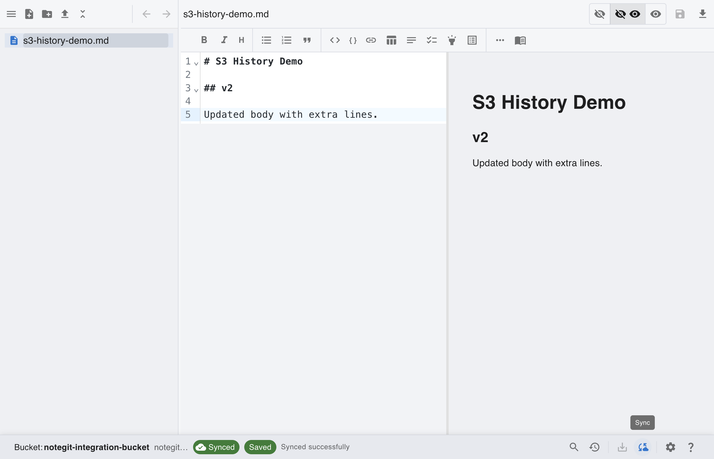
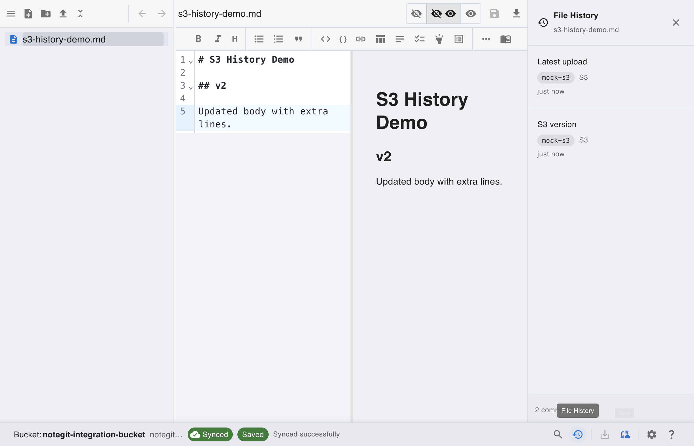
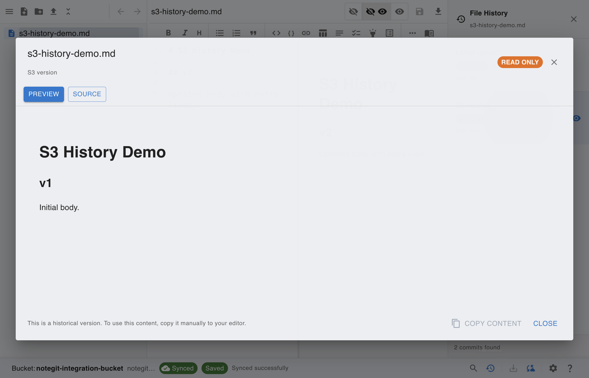
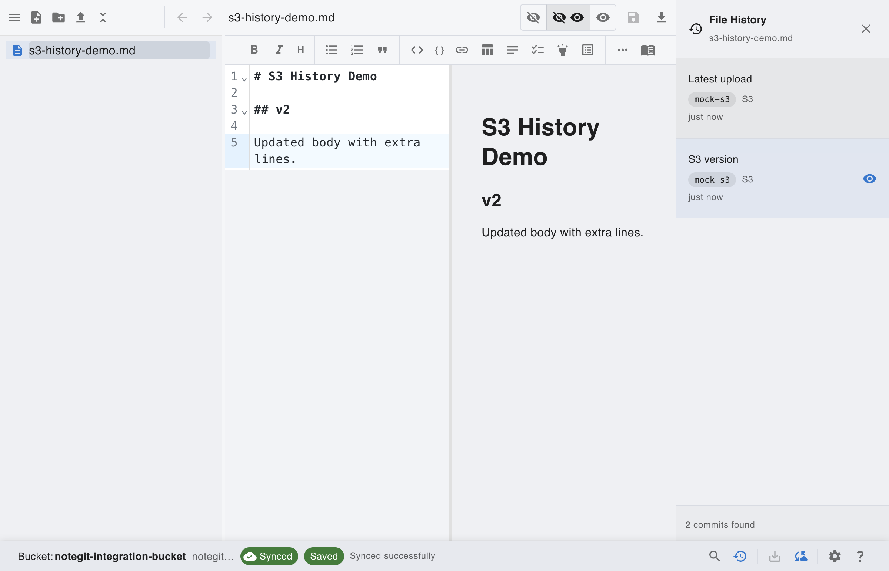

# [AWS S3] History with Versioned Objects

This scenario shows how AWS S3 object versions appear in history after multiple syncs.

## Step 1: Start from connected AWS S3 workspace

Connect to a versioned AWS S3 bucket before creating multiple historical versions.

## Step 2: Create and sync multiple versions

Save and sync two revisions so AWS S3 object version history is available.

## Step 3: Open AWS S3 history panel

Use the history action to view available AWS S3 object versions for the selected file.

## Step 4: Open versioned object content

Open a history entry to inspect that AWS S3 object version in the read-only viewer.

## Step 5: Return to current working version

Close the history viewer and continue working on the current file version in the editor.

## Versioning Notes

- AWS S3 bucket versioning must be enabled to retain object history.
- AWS S3 history viewer supports version inspection but not diff rendering.
