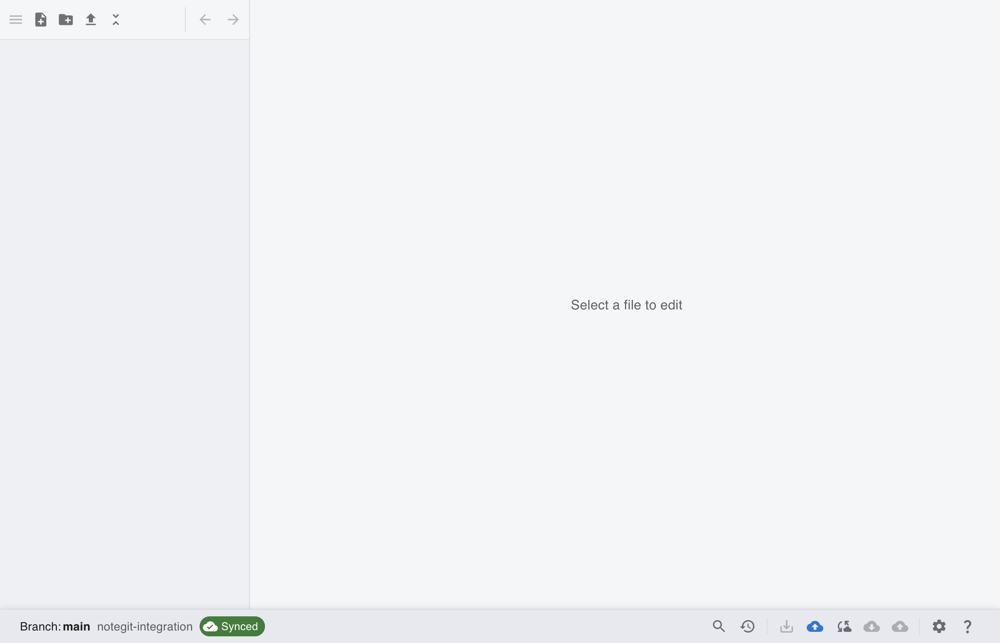
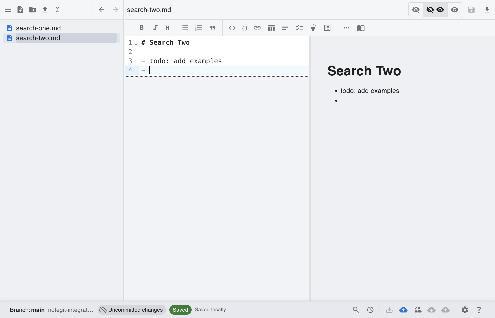

# [Git] Search and Replace (File and Repository)

This scenario currently includes setup screenshots plus manual step-by-step actions for file-level and repo-level replacement.

## Step 1: Start from connected Git workspace

Open notegit and connect your Git repository.

## Step 2: Prepare files with repeated search text

Create multiple markdown files containing the same term (for example `todo`) so replacements are easy to verify.

## Manual Steps for Search and Replace

1. Open repository search with `Ctrl/Cmd + Shift + F`.
2. In **Find**, enter the search term (for example `todo`).
3. Click **Search Repository**.
4. For file-level replace:

- Fill **Replace (optional)**.
- Click **Replace in file** on one result group.

5. For repo-level replace:

- Click **Replace All in Repo**.
- Confirm the prompt.

6. Verify replacements by reopening affected files.
