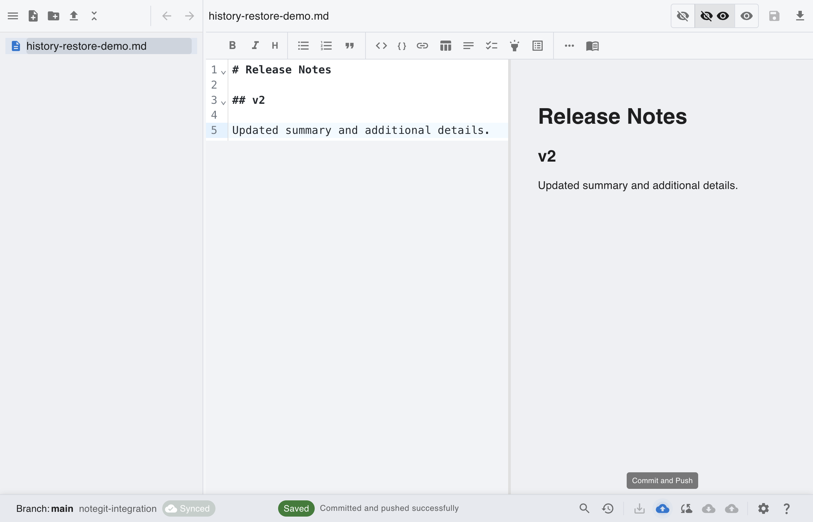
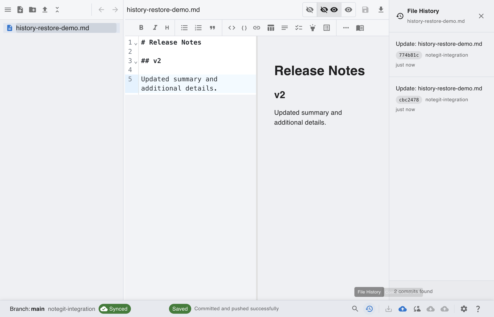
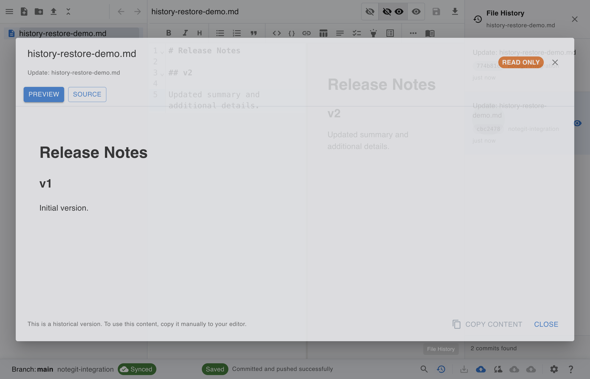
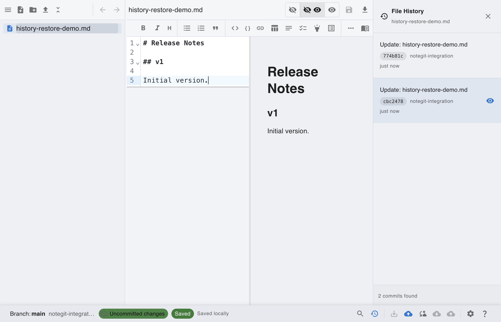

# [Git] View History and Restore Reference

This scenario demonstrates how to inspect older versions from file history and restore older content as the new reference.

## Step 1: Start from connected Git workspace

Connect to your Git repository and open the workspace before creating version history.

## Step 2: Create multiple committed versions

Save and commit at least two different versions so the history panel has entries to review.

## Step 3: Open file history panel

Use the status bar history action to list commits for the currently selected file.

## Step 4: Open older version in read-only viewer

Click a commit entry to inspect historical content safely in the read-only history viewer.

## Step 5: Restore older content as reference

Apply the older version content back into the editor, then save it as the new current reference.

## Manual Restore Notes

1. In the history viewer, click **Copy Content** on the version you want.
2. Close the viewer and paste into the editor.
3. Save and commit to make that version the new current reference.
